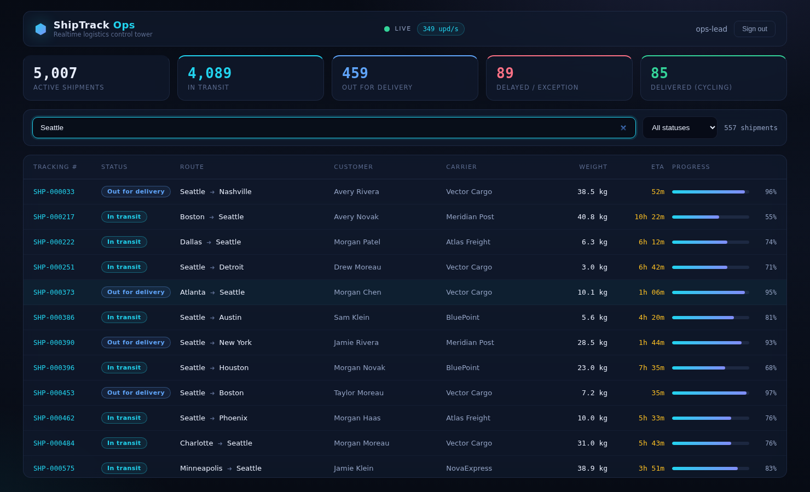

# ShipTrack Ops — Realtime Logistics Dashboard (React 19 + .NET 8)

A full‑stack, real‑time operations dashboard: a **.NET 8** backend streams live updates for
**5,000 shipments** over **SignalR (WebSocket)** to a **React 19** control‑tower UI that stays
smooth by rendering only what's visible.

> Sister project: the same backend with an **Angular 18** front‑end →
> [`realtime-logistics-dashboard-angular`](https://github.com/mauri0686/realtime-logistics-dashboard-angular)



## Architecture

```
┌───────────────────────┐      REST   GET /api/shipments  (snapshot)   ┌────────────────────────────┐
│       React 19        │  ─────────────────────────────────────────►  │    LogisticsTracker.Api    │
│      localhost:5173   │      WS     /hubs/shipments                  │    .NET 8  ·  :5080        │
│                       │  ◄═════════════════════════════════════════  │    REST + SignalR + JWT    │
└───────────────────────┘      "ShipmentsUpdated" deltas every 1s      └────────────────────────────┘
        JWT bearer ── POST /api/auth/login (demo: any non-empty credentials)
```

**The real‑time pattern:** REST answers the request/response question ("what is the fleet *now*?");
the WebSocket answers the push question ("what changed *since*?"). The client merges 350 delta
rows/second into an in‑memory `Map` and publishes one new immutable snapshot per tick.

## Why this is fast at 5,000 live rows

| Technique | Where |
|---|---|
| **Virtualisation (react-window)** — only visible rows exist in the DOM | `components/ShipmentsTable.tsx` |
| **External store + `useSyncExternalStore`** — the socket's lifetime is independent of render cycles; StrictMode-safe via ref-counted, single-flight connect | `hooks/useShipmentsFeed.ts` |
| **`memo` + immutable rows** — unchanged rows bail out on identity | `ShipmentsTable`, `KpiCards`, `StatusBadge` |
| **`useMemo` derivations** — filtering/KPIs recompute only when inputs change | `pages/DashboardPage.tsx` |
| **Debounced search** (custom `useDebouncedValue` hook) | `hooks/useDebouncedValue.ts` |

## React practices showcased

- **Custom hooks** as the unit of reuse (`useShipmentsFeed`, `useDebouncedValue`, `useAuth`)
- **`useSyncExternalStore`** for real‑time data — the modern answer to "socket + React state"
- **Context** for auth session (memoised value, no prop drilling)
- **Axios interceptors** — request: attach JWT; response: app‑wide 401 → logout (the React
  counterpart of an Angular HTTP interceptor)
- **Protected routes** with a `RequireAuth` wrapper (react-router v7), preserving the target URL
- **react-hook-form** — uncontrolled inputs (no re-render per keystroke), declarative validation
- **StrictMode-correct effects** — connect/release is ref-counted and single-flight, so the dev
  double-mount can't leak a second WebSocket (the classic real-time dashboard bug)
- **TypeScript strict** end to end — DTOs mirror the C# records

## Run it

Prereqs: .NET SDK 8, Node 20+.

```bash
# 1. backend
cd backend/LogisticsTracker.Api
dotnet run --urls http://localhost:5080        # Swagger at /swagger

# 2. frontend
cd frontend-react
npm install
npm run dev                                     # http://localhost:5173
```

Log in with **any** non‑empty username/password (e.g. `ops-lead` / `demo123`) — auth is a demo JWT
flow so the interceptor/protected-route pattern runs against a genuinely protected API (REST
**and** the WebSocket handshake via `access_token`).

## Backend notes (.NET 8)

- Minimal API + `MapHub<ShipmentsHub>` — REST and WebSocket share the same JWT auth scheme
- `BackgroundService` + `PeriodicTimer` drives the simulation and broadcasts deltas via
  `IHubContext` — clients never poll
- In‑memory, deterministic demo data (no database, no external services) — clone & run
